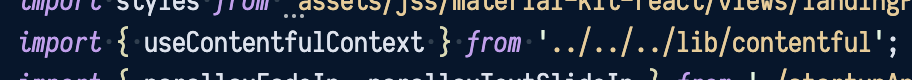
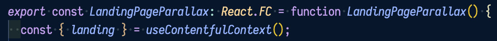
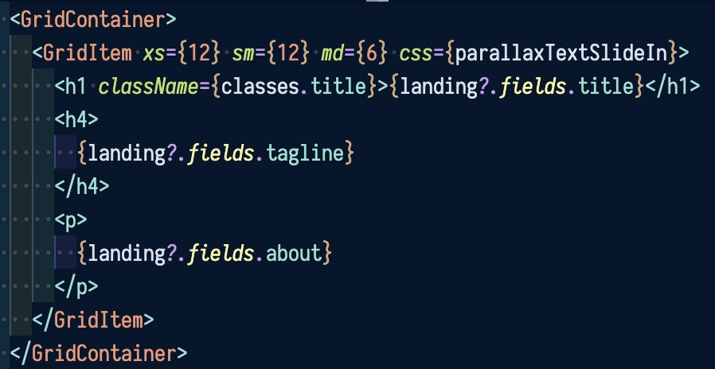

---

This is [the official website of FrontlineMasks](https://frontlinemasks.org/), a non-profit organization for facilitating donations of Personal Protective Equipment (PPE) during the COVID-19 crisis when PPE is prone to widespread price gouging

# Getting Started

This project uses the following components:
- JavaScript and [Node.js](https://nodejs.org/) for running our development environment
    - [React](https://reactjs.org/) for rendering the UI
        - [The Hooks API](https://reactjs.org/docs/hooks-intro.html) for managing and reacting to state changes in the UI
        - [The Context API](https://reactjs.org/docs/context.html) for managing global information, such as our Contentful data
    - [TypeScript](https://www.typescriptlang.org/) for a static type system, which is useful for answering questions like ["What properties does the `Button` component use?"](https://github.com/btoo/frontline-masks/blob/develop/src/components/CustomButtons/Button.tsx) or ["What fields have we defined in our Landing Page Contentful Model?"](https://github.com/btoo/frontline-masks/blob/develop/src/types.d.ts#L54-L66)
    - [Emotion](https://emotion.sh/) for styling and CSS
    - [Material UI Kit](https://demos.creative-tim.com/material-kit-react/#/documentation/tutorial) ([demo](https://demos.creative-tim.com/material-kit-react/#/)) for a starter template using [React and Google's Material Design framework](https://material-ui.com/)
- [Contentful](https://app.contentful.com/spaces/ab792hsrcg3y) for our database
- [Netlify](https://www.netlify.com/) for hosting the UI @ https://frontlinemasks.org/ (and other environments, e.g. https://develop.frontlinemasks.org/) and the [serverless functions](https://en.wikipedia.org/wiki/Serverless_computing) that we use as a proxy between our app and the Contentful API

## Installing the dependencies

In order to start developing in this project, you will need to have the following installed on your computer and executable from the command line:
- `git`
- `node`/`npm`

An easy way to install these tools is with [`choco` (for Windows)](https://chocolatey.org/docs/installation) or [`brew` (for Mac)](https://docs.brew.sh/Installation)

## Starting the development environment

Once you have these dependencies installed, you can `git clone` [the repository](https://github.com/btoo/frontline-masks), `cd` into it, and run [`npm run start`](https://github.com/btoo/frontline-masks/blob/develop/package.json#L52) to start the development environment. This should start the development webserver and open the development site @ http://localhost:3000/ in your browser

I recommend using [Visual Studio Code](https://code.visualstudio.com/) for your IDE, because it has really good support for TypeScript out of the box, is easy to install, and has good performance, but you can really use any IDE you prefer.

# Using Contentful

The reason we're storing the data in our Contentful database is twofold:
1. We want to allow the non-technical users (e.g. project owners or graphic designers) to be able to easily update the content through a user-friendly interface without needing anyt intervention from the engineers
2. We want to be able to quickly update the content without having to update the code and push them to the repository

Our [Contentful space](https://www.contentful.com/help/spaces-and-organizations/#what-are-spaces-and-organizations) is located [here](https://app.contentful.com/spaces/ab792hsrcg3y). It consists of:
- [Models](https://app.contentful.com/spaces/ab792hsrcg3y/content_types) (database tables)
- [Entries](https://app.contentful.com/spaces/ab792hsrcg3y/entries?id=hFVk7wgNJ9OV3wqY&order.fieldId=updatedAt&order.direction=descending&login=1&displayedFieldIds=contentType&displayedFieldIds=updatedAt&displayedFieldIds=author&already_authenticated=1) (table rows) - this is where the data like our company name, Instagram url, Mission page text, etc. will live
- [Media](https://app.contentful.com/spaces/ab792hsrcg3y/assets?id=ZEYKDX7pemdGA5cg&order.fieldId=updatedAt&order.direction=descending&displayedFieldIds=contentType&displayedFieldIds=updatedAt&displayedFieldIds=author&already_authenticated=1) (file storage) - this is where data like the url of the landing page background image will live

## Adding data to Contentful

### Working with the tables

You can view, create, update, and delete models _and_ their fields from [here](https://app.contentful.com/spaces/ab792hsrcg3y/content_types). Be careful when you edit or remove existing models/fields because there may already be code that expects them to exist.

[__Once you add a new field, however, you should remember to also update the corresponding TypeScript definition of this model in our codebase.__](https://github.com/btoo/frontline-masks/blob/develop/src/types.d.ts) Without doing this, the project will fail to compile when you try to access a field that the TypeScript compiler has not recognized yet. The TypeScript compiler will assist you with helpful error messages when you run into issues like this.

### Working with table rows and files

You can view, create, update, and delete table rows (aka "entries" in Contentful) [here](https://app.contentful.com/spaces/ab792hsrcg3y/entries?id=hFVk7wgNJ9OV3wqY&order.fieldId=updatedAt&order.direction=descending&login=1&displayedFieldIds=contentType&displayedFieldIds=updatedAt&displayedFieldIds=author&already_authenticated=1) and files (aka "media" in Contentful) [here](https://app.contentful.com/spaces/ab792hsrcg3y/assets?id=ZEYKDX7pemdGA5cg&order.fieldId=updatedAt&order.direction=descending&displayedFieldIds=contentType&displayedFieldIds=updatedAt&displayedFieldIds=author&already_authenticated=1). Again, Be careful when you edit or remove existing models/fields because there may already be code that expects them to exist.

## Display data from Contentful

When the app loads (i.e. the user opens https://frontlinemasks.org/, you navigate to http://localhost:3000/, etc.) during initialization, the app will automatically perform these tasks:
1. create a ["React context"](https://reactjs.org/docs/context.html), which we'll call the `ContentfulContext`, for storing data from our Contentful database which will be accessible from anywhere in our app globally
2. declare some globally-accessible data along with their with their ["setters"](https://en.wikipedia.org/wiki/Mutator_method)
    - [see code](https://github.com/btoo/frontline-masks/blob/develop/src/lib/contentful.tsx#L12-L14)
3. fetch our data from Contentful using the Contentful API and use the setters to save them in our context
    - [see code](https://github.com/btoo/frontline-masks/blob/develop/src/lib/contentful.tsx#L16-L31)
4. expose the data fetched from Contentful to consumers of the `ContentfulContext`
    - [see code](https://github.com/btoo/frontline-masks/blob/develop/src/lib/contentful.tsx#L47)

Once these tasks have been completed by the app's automatic initialization, you can create [React components](https://reactjs.org/docs/components-and-props.html#function-and-class-components) (which you can think of as HTML partials) and use the `ContentfulContext` within any of them like so:
1. [`import`](https://developer.mozilla.org/en-US/docs/Web/JavaScript/Reference/Statements/import) the [`ContentfulContext`](https://github.com/btoo/frontline-masks/blob/develop/src/lib/contentful.tsx#L56-L58) React Hook:
    ```tsx
    import { useContentfulContext } from 'lib/contentful';
    ```
2. _Inside_ your component, access the `ContentfulContext` state like so:
    ```tsx
    import { useContentfulContext } from 'lib/contentful';

    function MyComponent() {
        const contentfulContext = useContentfulContext();
        return (
            <div>
                <h1>
                    {contentfulContext.path.to.titleData}
                </h1>
                <p>
                    {contentfulContext.path.to.descriptionData}
                </p>
            </div>
        );
    };
    ```
3. [`export`](https://developer.mozilla.org/en-US/docs/web/javascript/reference/statements/export) your component to make it `import`able from other files:
    
    `src/components/MyComponent.tsx`:
    ```tsx
    import { useContentfulContext } from 'lib/contentful';

    function MyComponent() { /* ...component contents... */ };

    export { MyComponent };
    ```

    `src/views/MyPage.tsx`:
    ```tsx
    import { MyComponent } from 'components/MyComponent';

    function MyPage() {
        return (
            <div>
                This is my component:
                <MyComponent />
            </div>
        )
    };

    export { MyPage };
    ```

Here's a simple example of this in action on [the Landing page's `Parallax`](https://github.com/btoo/frontline-masks/blob/develop/src/views/LandingPage/Parallax/index.tsx) (the "splash" content you see when you land of the page):
1. `import` the `ContentfulContext` React Hook

    

2. _Inside_ the `LandingPage`'s exported React component, get the [`landing` data](https://github.com/btoo/frontline-masks/blob/develop/src/lib/contentful.tsx#L14) (which will have already been automatically fetched from Contentful during app initialization) from the `ContentfulContext`

    

3. [Render the data in the markup](https://reactjs.org/docs/introducing-jsx.html)

    
